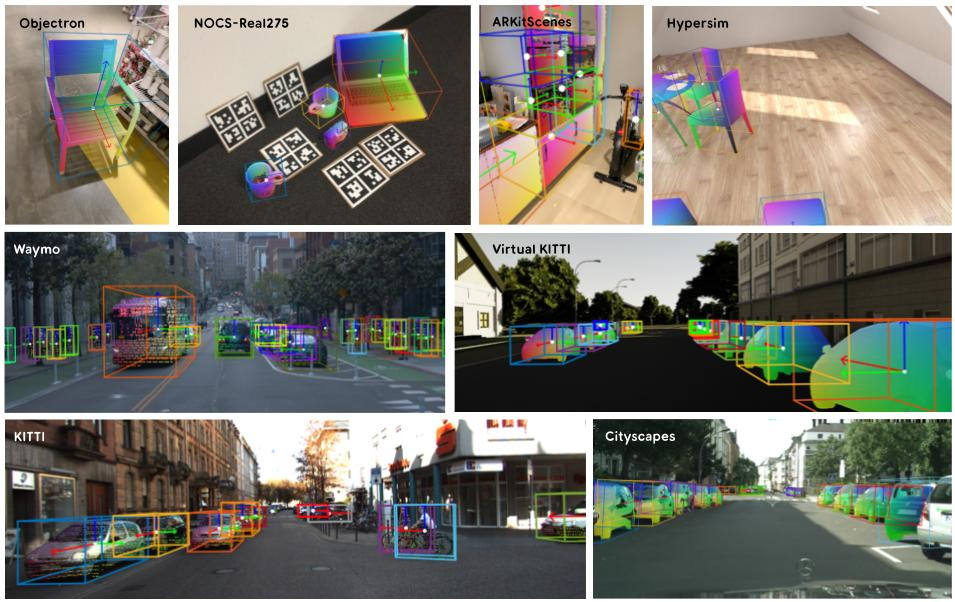
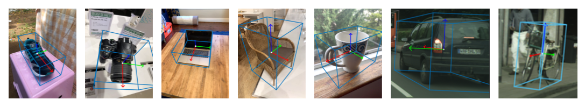

# OmniNOCS

This is the official repository for the OmniNOCS dataset. OmniNOCS is a
large-scale NOCS dataset with ground truth annotations for data from different
domains: outdoor scenes, indoor scenes, and object-centric videos. OmniNOCS
contains independent frames, the objects in which are labelled with canonical 3D
orientations, instance masks, and 3D NOCS coordinates. This repository provides
the OmniNOCS annotations for these data sources: [KITTI], [Virtual-KITTI],
[nuScenes], [Waymo-OD], [Cityscapes], [Hypersim], [Objectron], [ARKitScenes],
and [NOCS-Real275].



## Data format

Each frame in OmniNOCS provides instance segmentations, NOCS coordinates and 3D
bounding boxes in the following format:

-   <b>Instance segmentations</b>: An instance map image stored at
    `<path_to_frame>_instances.png`, as a 16-bit single-channel PNG image. Each
    object with a valid mask has its instance ID at each pixel in its mask. The
    instance ID is unique to this particular frame. Regions without a valid
    object index can either be background (contains 0) or unknown (contains
    65535). Unknown regions should not be used for supervision / evaluation.

-   <b>NOCS coordinates</b>: A NOCS map stored at `<path_to_frame>_nocs.png` as
    a 16-bit 4-channel PNG image. The first 3 channels represent the X,Y,Z NOCS
    values. The last channel is a binary mask that denotes whether the pixel
    location contains a valid NOCS coordinate. Note that the NOCS annotations in
    some domains (particularly outdoor datasets such as KITTI) are sparse, and
    therefore all pixels within an object's instance mask need not have valid
    NOCS coordinates.

-   <b>3D bounding box</b>: We provide the 3D bounding box for each object in a
    frame in the JSON metadata file (explained below).

Each OmniNOCS `<source>-<split>` combination (for example `KITTI-train`) has its
own JSON metadata file. Each JSON contains a list of per-frame metadata, with
the length of the list being equal to the number of frames in the particular
combination. For each frame, the metadata has the following structure:

```
'objects': [
  // A dict for each object in the frame.
  {
    'rotation': 3x3 canonical orientation (object to camera transformation),
    'translation': 3x1 3D translation (in meters) (in camera coordinates),
    'size': 3x1 3D size (in meters),
    'object_id': instance ID used in the instance segmentation map,
    'category': name of the object class as a string,
  }
  ...
]
'image_name': Path to the image for this frame in the original dataset.
'omninocs_name': Path to the NOCS and instance images for this frame in OmniNOCS.
'nocs_image_downscale': Scalar NOCS downscaling factor (Image resolution / NOCS map resolution), for cases where the NOCS image is smaller than the color image.
'intrinsics': {
  'fx': Focal length (x) in pixels.
  'fy': Focal length (y) in pixels.
  'cx': Principal point (x) in pixels.
  'cy': Principal point (y) in pixels.
}
```

## Coordinate convention

We use right-handed coordinate frames for objects and cameras.

<b>Object coordinate frame</b>:

OmniNOCS objects have a per-category canonically oriented frames. This means
that the X, Y and Z axes of all objects in the category are consistently
oriented. For example, cars have the +X axis forwards, +Y axis to their left and
the +Z axis pointing upwards. When objects are placed upright in the scene,
their +Z axis points in the direction opposite to gravity. Examples for a few
object categories are shown below:



There are a few classes with symmetries (eg: bottle or bowl) that have
rotational symmetry about an axis, making the canonical orientation ambiguous.
We are also aware that there are a few objects for which the orientations may
not be canonical, due to occlusions or labelling error. Please report any such
cases you may find, so that they can be removed or corrected.

<b>Camera coordinate frame</b>:

Our camera convention uses the +X axis towards right, +Y downwards, and +Z
outwards from the camera. Our metadata files only contain the camera intrinsics
(without extrinsics), since the object pose is already provided with respect to
the camera frame.

## Download

OmniNOCS provides NOCS annotations for images from other datasets. Please refer
to [SETUP.md](./SETUP.md) for instructions to download all data and setup
OmniNOCS.

Links to download OmniNOCS will be available soon!

## Usage

To visualize our data and illustrate its usage, we provide a colab that
downloads a small mini split of the training set and visualizes the NOCS and
bounding box annotations from OmniNOCS.
[](./notebooks/OmniNOCS_dataset_visualization.ipynb)

## Citing this work

Add citation details here, usually a pastable BibTeX snippet:

```latex
@article{omninocs2024},
      title={OmniNOCS: A unified NOCS dataset and model for 3D lifting of 2D objects},
      author={Akshay Krishnan and Abhijit Kundu and Kevis-Kokitsi Maninis and James Hays and Matthew Brown},
      year={2024},
}
```

## License and disclaimer

Copyright 2024 DeepMind Technologies Limited

All software is licensed under the Apache License, Version 2.0 (Apache 2.0); you
may not use this file except in compliance with the Apache 2.0 license. You may
obtain a copy of the Apache 2.0 license at:
https://www.apache.org/licenses/LICENSE-2.0

Our dataset adds annotations to images from the datasets listed below, these are
made available with licenses as follows:

Dataset       | License
------------- | -------
KITTI         | [CC BY-NC-SA 3.0 DEED](https://creativecommons.org/licenses/by-nc-sa/3.0/)
ARKitScenes   | [CC BY-NC-SA 4.0 DEED](https://creativecommons.org/licenses/by-nc-sa/4.0/)
Virtual KITTI | [CC BY-NC-SA 3.0 LEGAL CODE](https://creativecommons.org/licenses/by-nc-sa/3.0/legalcode)
nuScenes      | [CC BY-NC-SA 4.0](https://creativecommons.org/licenses/by-nc-sa/4.0/deed.en)
Hypersim      | [CC BY-NC-SA 3.0 DEED](https://creativecommons.org/licenses/by-sa/3.0/)
NOCS-Real275  | [MIT](https://opensource.org/license/mit)
Waymo OD      | [Apache 2.0](https://github.com/waymo-research/waymo-open-dataset/blob/master/LICENSE) ([See Waymo terms](https://waymo.com/open/terms/))
Objectron     | [Microsoft C-UDA](https://github.com/microsoft/Computational-Use-of-Data-Agreement)
Cityscapes 3D | [CC-BY 4.0](https://creativecommons.org/licenses/by/4.0/deed.en)

All other materials are licensed under the Creative Commons Attribution 4.0
International License (CC-BY). You may obtain a copy of the CC-BY license at:
https://creativecommons.org/licenses/by/4.0/legalcode

Unless required by applicable law or agreed to in writing, all software and
materials distributed here under the Apache 2.0 or CC-BY licenses are
distributed on an "AS IS" BASIS, WITHOUT WARRANTIES OR CONDITIONS OF ANY KIND,
either express or implied. See the licenses for the specific language governing
permissions and limitations under those licenses.

This is not an official Google product.

[KITTI]: http://www.cvlibs.net/datasets/kitti/eval_3dobject.php
[Virtual-KITTI]: https://europe.naverlabs.com/research/computer-vision/proxy-virtual-worlds-vkitti-2/
[Objectron]: https://github.com/google-research-datasets/Objectron
[NOCS-Real275]: https://github.com/hughw19/NOCS_CVPR2019
[Cityscapes]: https://www.cityscapes-dataset.com/
[nuScenes]: https://www.nuscenes.org/
[Waymo-OD]: https://waymo.com/open/
[ARKitScenes]: https://github.com/apple/ARKitScenes
[Hypersim]: https://github.com/apple/ml-hypersim
